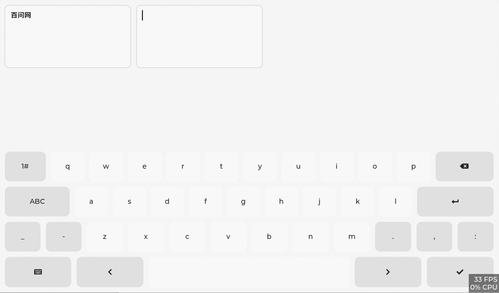

<h1 align="center"> lv_100ask_pinyin_ime</h1>

lv_100ask_pinyin_ime is a custom component written on the basis of lv_keyboard, it is no different from lv_keyboard, but the function of supporting Pinyin input method (Pinyin) is added.

**English** | [中文](./README_zh.md) |

# Introduction

`lv_100ask_pinyin_ime` is a custom component written on the basis of lv_keyboard (the creation interface is: `lv_100ask_pinyin_ime_create(lv_obj_t *parent));` ), it is no different from [lv_keyboard](https://docs.lvgl.io/master/widgets/extra/keyboard.html), but the function of supporting Pinyin input method (Pinyin) is added.

So we call it: **Support pinyin input method LVGL keyboard (lv_keyboard) widget enhancement plugin**.

Normally, as long as lvgl can run in an environment `lv_100ask_pinyin_ime` can also run! There are two main influencing factors: the size of the font file used and the size of the thesaurus used.

`lv_100ask_pinyin_ime` is very simple to use, and the subsequent custom expansion functions are also very convenient, so stay tuned for more functions.

# Usage
Refer to the example in **lv_lib_100ask/test/lv_100ask_pinyin_ime_test**.

# About
This is an open project and contribution is very welcome!
Contact us: smilezyb@163.com